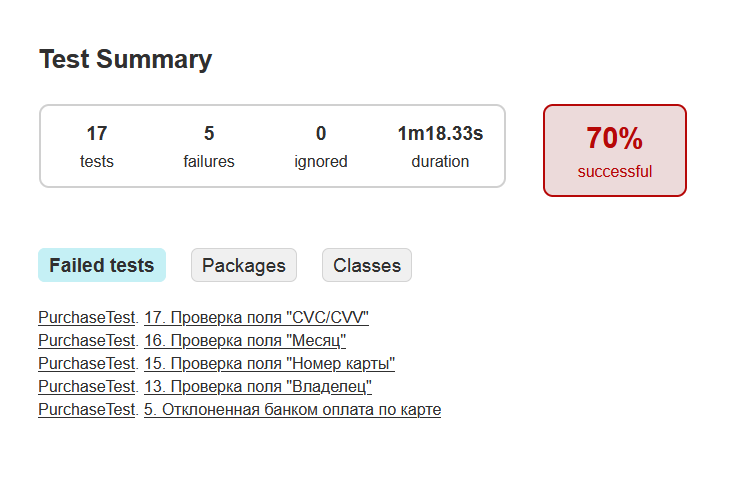
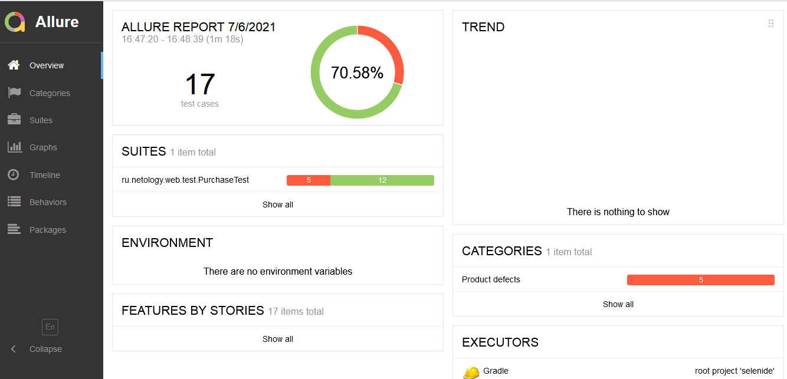
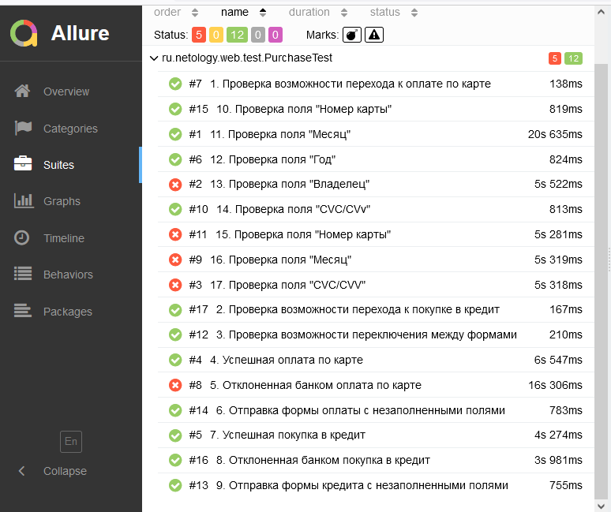

### Отчет по итогам тестирования

**Краткое описание**

Проект представляет собой автоматизацию тестирования комплексного сервиса, взаимодействующего с СУБД и API банка. Задача проекта - составить план автоматизации, включающий все тестовые сценарии, и провести непссредственно тестирование веб-сервиса, предлагающего купить туристический тур, с целью выявления дефектов.  

Автоматизация выполнена с учетом следующих требований:  

1. реализованы UI-тесты посредством библиотек Junit 5 (5.7.0) и Selenide (5.19.0);  
2. по результатам прогона тестов генерятся репорты Gradle и Allure  
3. реализована возможность выполнения запросов в базу данных для  проверки корректности записываемых данных.  

**Количество тест-кейсов**  

Всего: 17 тест-кейсов  
Успешных: 12 (70%)  
Неуспешных: 5 (30%)  

Отчет Gradle:  

Отчет Allure:  
  

**Общие рекомендации**  
**Найденные баги**  

[1. Отсутствует валидация поля "Владелец"](https://github.com/lifanova/aqa-diploma/issues/1)  

[2. Успешная оплата/кредит с карты, имеющей статус declined](https://github.com/lifanova/aqa-diploma/issues/2)  

[3. Ошибка при создании записи в таблице order_entity при покупке в кредит](https://github.com/lifanova/aqa-diploma/issues/3)  

[4. Неверные сообщения об ошибках при валидации полей](https://github.com/lifanova/aqa-diploma/issues/4)  

[5. Сообщения об ошибках не исчезают после ввода корректных значений](https://github.com/lifanova/aqa-diploma/issues/5)  

[6. Падение приложения при отправке данных с некорректным значением поля "Номер карты"](https://github.com/lifanova/aqa-diploma/issues/6)  

[7. Неполная валидация поля "Месяц"](https://github.com/lifanova/aqa-diploma/issues/7)  

[8. Неполная валидация поля "CVC/CVV"](https://github.com/lifanova/aqa-diploma/issues/8)  

**Рекомендации по улучшению интерфейса**  

1. Исправить баг, который приводит к падению приложения и делает дальнейшую работу с ним невозможной.   
2. Исправить неточность при записи в базу данных, в результате которой в будущем могут возникнуть критические дефекты.  
3. Реалиовать валидацию имени владельца карты.  
4. Исправить неверные валидационные сообщения.  
5. Реализовать алгоритм проверки номера карты.  
    

